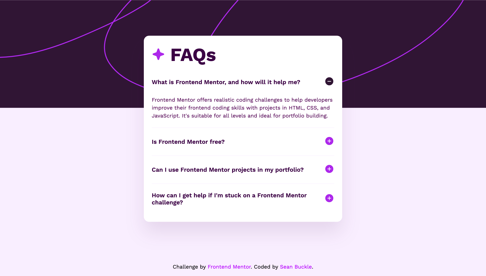

# FAQ Accordion | Semantic UI Component 💡
A high-performance, WCAG-compliant accordion component built with a focus on semantic HTML5 and modular SCSS. This project demonstrates how to leverage native browser features for interactive elements, ensuring maximum performance and accessibility with zero JavaScript overhead.

## 📸 Preview



## 🚀 Technical Highlights

- **Markup Architecture:** Pure HTML5 using semantic elements for native browser accessibility.
- **Styling Architecture:** Modular SCSS following the BEM (Block Element Modifier) methodology for "leak-proof" styles.
- **Accessibility First:** Engineered to support screen readers and keyboard navigation natively without custom script intervention.
- **Responsive Fluidity:** Mobile-first workflow using relative units (rem, em) and CSS Grid for layout stability.
- **Zero-JS Implementation:** Achieves complex interaction patterns using pure CSS, resulting in a perfect performance score.

## 🏗️ Architectural Overview

### 1. Inclusive A11y Design

Accordions are critical UI patterns that often fail accessibility standards when over-scripted. This solution implements a "Native-First" strategy:
- **Native Keyboard Support:** Utilises semantic elements that are inherently focusable and navigable via Tab, Space, and Enter keys.
- **Standardised ARIA Patterns:** By leveraging native HTML5 interactive elements, the component automatically communicates state changes (expanded/collapsed) to assistive technologies.
- **Focus States:** Custom-engineered high-visibility focus indicators ensure the component is easily usable for keyboard-only users.

### 2. Scalable Style System (BEM + SCSS)

The UI architecture is built for maintainability and easy integration into larger codebases:
- **BEM Methodology:** Used to encapsulate styles, ensuring the accordion can be dropped into any project without CSS specificity conflicts.
- **Micro-Interactions:** Leverages SCSS-driven transitions for smooth, performant expansion and contraction of content panels.
- **Visual Feedback:** Custom-engineered hover and active states for interactive elements to provide clear visual cues during navigation.

### 3. Performance & Layout Stability

Because this solution avoids the "Main Thread" overhead of JavaScript, it offers superior performance metrics:
- **Sub-millisecond TBT:** Total Blocking Time is effectively zero, as the browser handles the interaction logic natively.
- **Layout Stability:** Engineered to prevent "layout shift" during animations, maintaining a high Cumulative Layout Shift (CLS) score.
- **Critical Path Rendering:** Optimised for instantaneous interaction as soon as the CSS is parsed.

### 4. Asset Optimisation

- **Optimised SVGs:** Interactive icons are handled via optimised SVGs to ensure sharpness at any resolution without adding significant weight to the page.
- **Mobile-First SCSS:** Media queries are structured to deliver only the necessary styles for the viewport, reducing the browser's computation time.

## 🛠️ Built With


## 🔗 Live Implementation

- **Live Site:** [https://faq-accordion.seanbuckle.com](https://faq-accordion.seanbuckle.com)
- **Source Code:** [https://github.com/seanbuckle/faq-accordion](https://github.com/seanbuckle/faq-accordion)

1. **Clone the repository:**
   ```bash
   git clone https://github.com/seanbuckle/faq-accordion.git
2. **Navigate to the directory:**
   ```bash
   cd faq-accordion
3. **Open the project:** Simply open `index.html` in your preferred browser.

## 👨‍💻 Author

**Sean Buckle**

[Frontend Mentor Profile](https://www.frontendmentor.io/profile/seanbuckle) 

[LinkedIn](https://www.linkedin.com/in/seanbuckle)

## 📜 License

This project is licensed under the MIT License - see the [LICENSE](https://github.com/seanbuckle/faq-accordion/blob/main/LICENSE) file for details.

---

***Note: This project was built as a solution to a Frontend Mentor challenge.***
